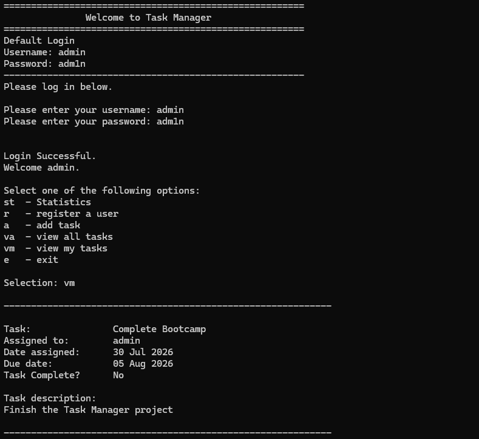

# Task Manager

A command-line Python application for multi-user task management, with authentication and admin-only functionality. This project demonstrates user authentication logic, role-based access control, and menu-driven task handling in Python.

## Screenshots



## Features

- User login with authentication
- Add, view, and manage tasks assigned to users
- Admin-only menu and functionality
- Tasks presented in a user-friendly, readable format

## Tech Stack

Python, SQLite

## Installation

1. Clone the repository

   ```bash
   git clone https://github.com/SZStanton/Task-Manager
   ```

2. Navigate into the project folder

3. Run the app

   ```bash
   python main.py
   ```
